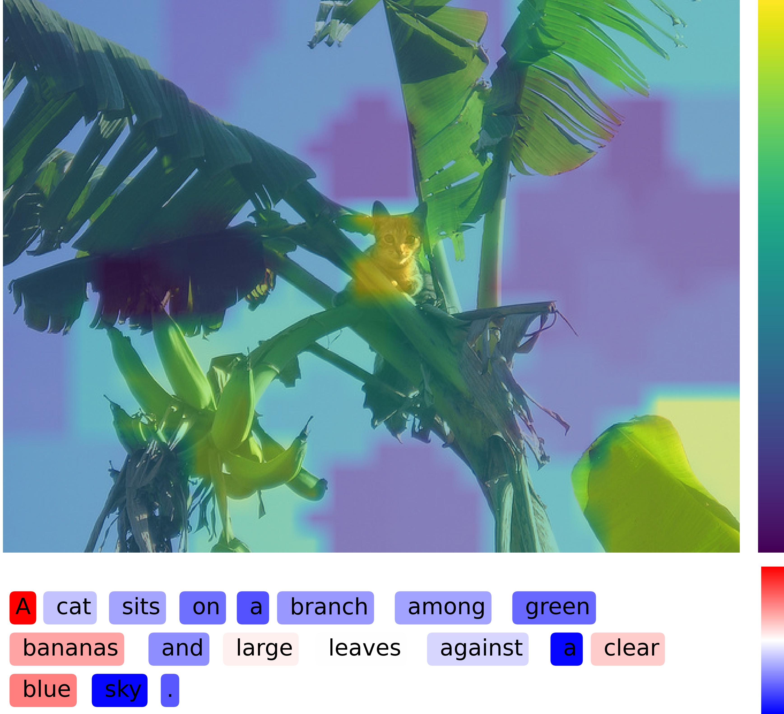
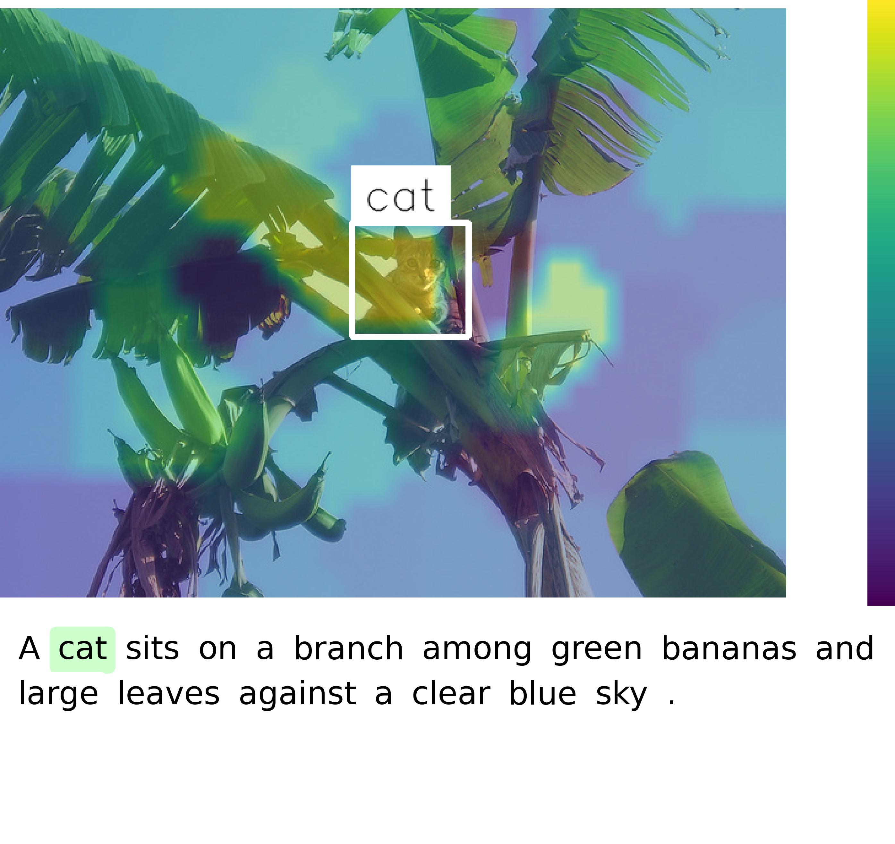
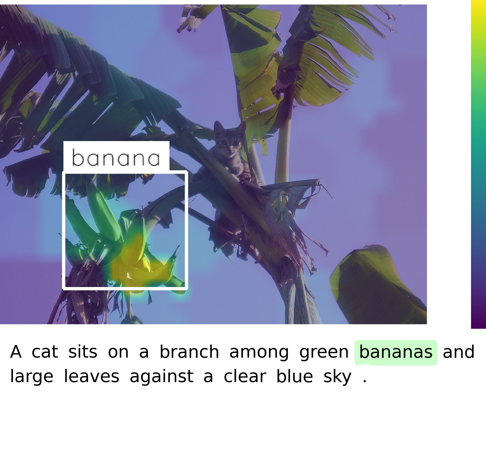

<h2 align="center"> <a href="">Interpreting Multimodal Large Lanugage Models</a></h2>
<h5 align="center"> If you like our project, please give us a star ⭐ on GitHub for latest update.  </h2>

## 📰 News & Update

- **[2025.05.03]** We begin by investigating the possibility of attribution in multimodal large language models (MLLMs).

## 🛠️ Environment

For our interpretation method, the packages we use are relatively common. Please mainly install `pytorch`, etc.

## 🧳 Quickly Try

You can experience the interpretability of a single image directly in the Jupyter notebook.

### [Qwen2.5-VL](https://github.com/QwenLM/Qwen2.5-VL)

Please explore it from the file [tutorial/Qwen25VL-Interpretation.ipynb](./tutorial/Qwen25VL-Interpretation.ipynb). You can directly modify the Qwen-VL series models (covering versions from 2 to 2.5, with different parameter sizes such as 3B and 7B). Below is the interpretation result of the Qwen2.5-VL 3B model.

|Sentence-level Interpretation| Word-level Interpretation `cat` | Word-level Interpretation `banana` |
|:-:|:-:|:-:|
||||

## 🗝️ How to Run

Prepare the datasets following [here](datasets/README.md).

