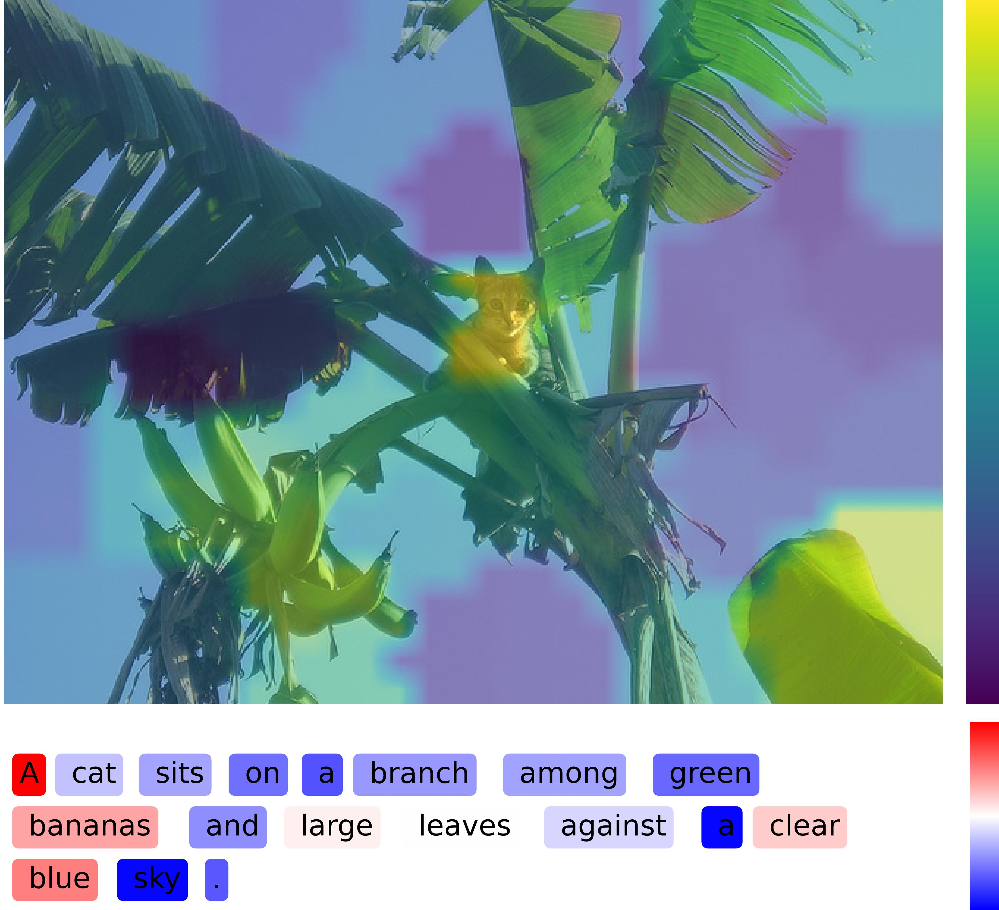
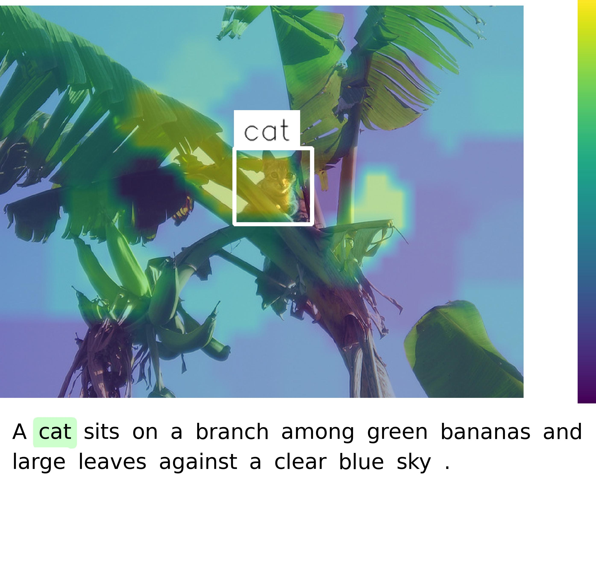
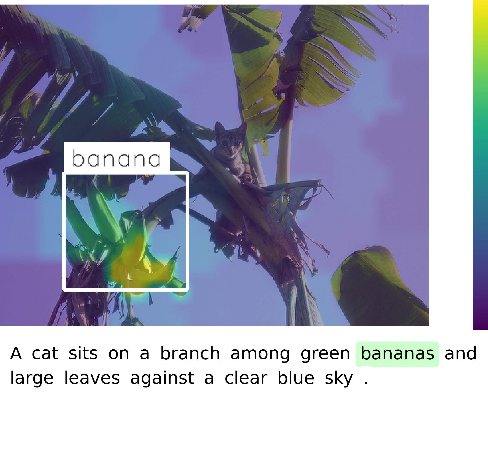
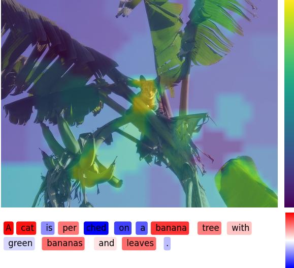
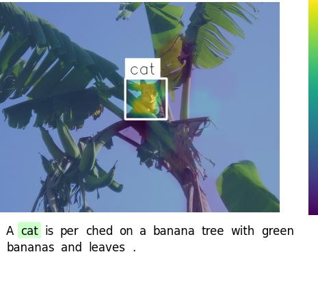
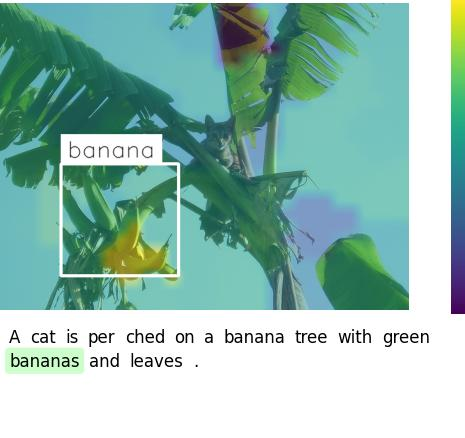
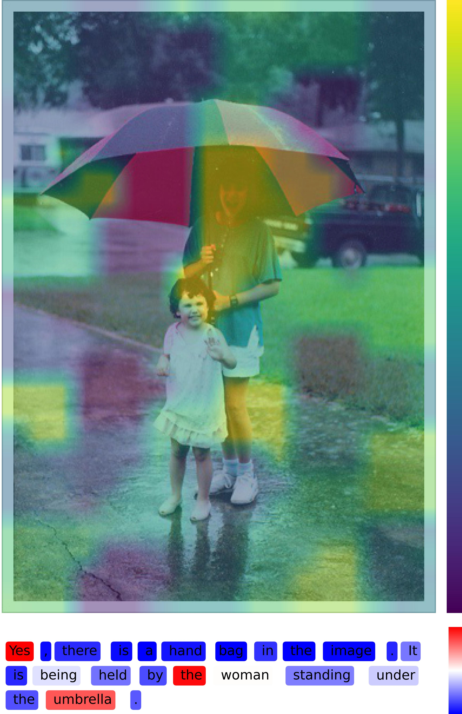
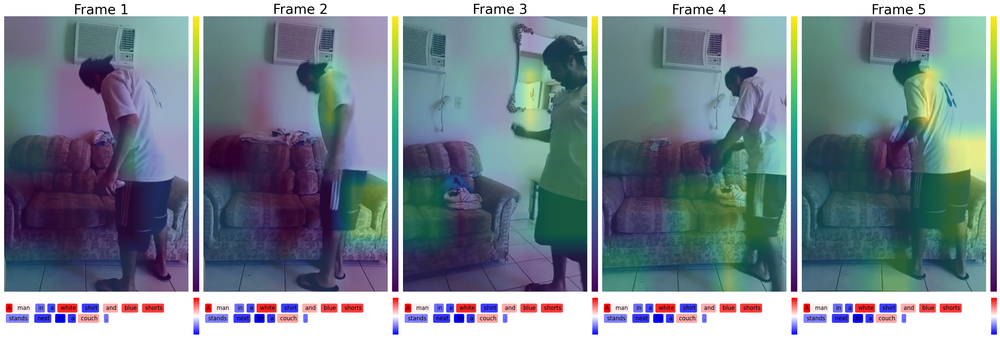
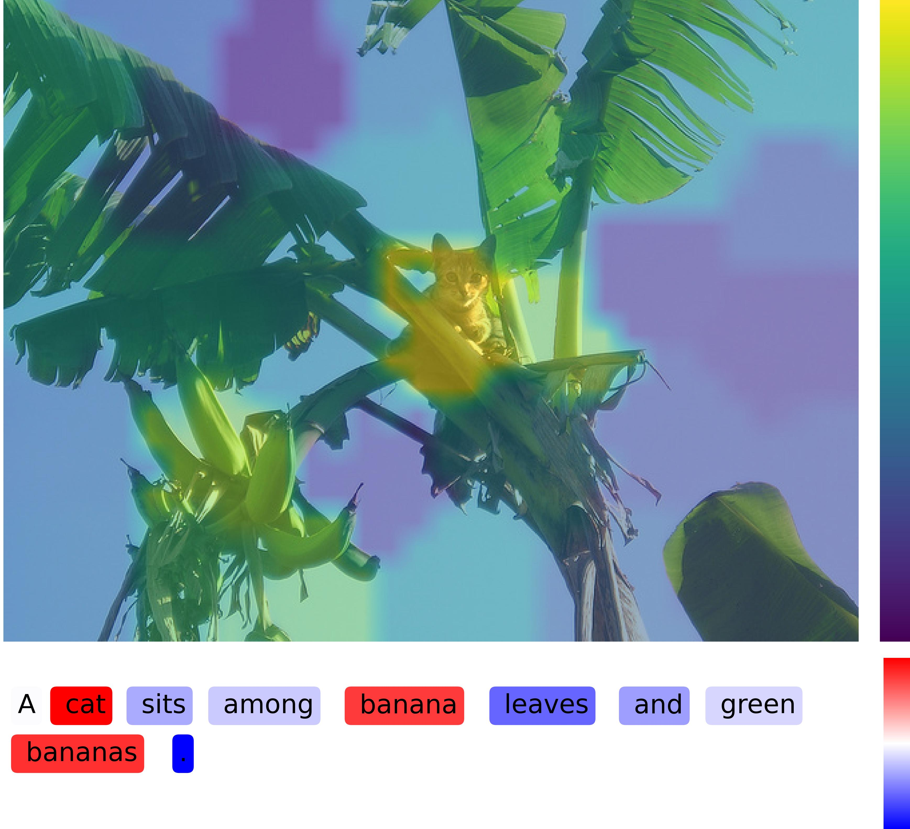

<h2 align="center"> <a href="https://arxiv.org/abs/2509.22496">[CVPR 2026 🔥] Where MLLMs Attend and What They Rely On: Explaining Autoregressive Token Generation</a></h2>
<h5 align="center"> If you like our project, please give us a star ⭐ on GitHub for latest update.  </h2>

[](https://arxiv.org/abs/2509.22496)

<p align = "center">

</p>

## 📰 News & Update

- **[2026.03.20]** Video explanation and API-based explanation is update to the tutorial

- **[2026.03.10]** Efficient attribution version is update to the tutorial

- **[2026.02.21]** Our paper has been accepted by CVPR 2026.

- **[2025.05.03]** We begin by investigating the possibility of attribution in multimodal large language models (MLLMs).

## 🛠️ Environment

For our interpretation method, the packages we use are relatively common. Please mainly install `pytorch`, etc.

## 🧳 Quickly Try

You can experience the interpretability of a single image directly in the Jupyter notebook.

### [Qwen2.5-VL](https://github.com/QwenLM/Qwen2.5-VL)

Please explore it from the file [tutorial/Qwen25VL-Interpretation.ipynb](./tutorial/Qwen25VL-Interpretation.ipynb). You can directly modify the Qwen-VL series models (covering versions from 2 to 3, with different parameter sizes such as 3B and 7B). Below is the interpretation result of the `Qwen2.5-VL 3B` model.

|Sentence-level Interpretation| Word-level Interpretation `cat` | Word-level Interpretation `banana` |
|:-:|:-:|:-:|
||||

### [InternVL 3.5](https://github.com/OpenGVLab/InternVL)


Please explore it from the file [tutorial/InternVL3_5-Interpretation.ipynb](./tutorial/InternVL3_5-Interpretation.ipynb). You can directly modify the InternVL series models (covering versions from 1 to 3.5, with different parameter sizes such as 4B and 8B). Below is the interpretation result of the `InternVL 4B` model.

|Sentence-level Interpretation| Word-level Interpretation `cat` | Word-level Interpretation `banana` |
|:-:|:-:|:-:|
||||

### Interpreting Qwen2.5-VL Object Hallucination

Please explore it from the file [tutorial/Qwen25VL-Hallucination-Interpretation.ipynb](./tutorial/Qwen25VL-Hallucination-Interpretation.ipynb). You can directly modify the Qwen-VL series models (covering versions from 2 to 2.5, with different parameter sizes such as 3B and 7B). Below is the interpretation result of the `Qwen2.5-VL 3B` model.

**Question: Is there a handbag in the image?**

|Hallucination Results Interpretation|Interpreting and Mitigating Hallucination|
|--|--|
|  |  |


### Interpreting Video Understanding

Please explore it from the file [tutorial/Video_interpretation.ipynb](./tutorial/Video_interpretation.ipynb).



### Interpreting ChatGPT-API

Please explore it from the file [tutorial/API_interpretation.ipynb](./tutorial/API_interpretation.ipynb).

<table style="width:100%; table-layout:fixed; text-align:center;">
  <tr>
    <th>ChatGPT-5.2</th>
    <th>Qwen2.5-VL</th>
    <th>InternVL-3.5</th>
  </tr>
  <tr>
    <td></td>
    <td></td>
    <td></td>
  </tr>
</table>


## 🗝️ Reproduce the Results of the Paper

### 1. Prepare the Datasets

Prepare the datasets following [here](datasets/README.md).

### 2. Get the Attribution Files

To get the original `EAGLE` explanation files (sentence-level explanation):

```
python -m faithfulness_explanation.Qwen25-VL-3B.Qwen25-VL-3B-coco-caption
```

You will get the json files and npy files at fold `./interpretation_results/Qwen2.5-VL-3B-coco-caption/slico-1.0-1.0-division-number-64`.

More models or tasks please see fold [./faithfulness_explanation/](./faithfulness_explanation/)

### 3. Evaluation Metrics

For faitufulness metrics computing:

```shell
python -m evals.eval_AUC_faithfulness \
    --explanation-dir ./interpretation_results/Qwen2.5-VL-3B-coco-caption/slico-1.0-1.0-division-number-64
```

You will get `Insertion AUC`, `Deletion AUC`, and `Average Highest Confidence`.

For location metrics computing (only for word-level explanation in our paper):

```shell
python -m evals.eval_point_game \
    --explanation-dir ./interpretation_results/interpretation_results/LLaVA-1_5-7B-coco-object/slico-1.0-1.0-division-number-64
```

You will get `Point Game (Box)` and `Point Game (Mask)` metrics.

For hallucination explantion evaluation:

```shell
python -m evals.eval_hallucination_correction \
    --explanation-dir interpretation_results/LLaVA-1_5-7B-RePOPE/slico-1.0-1.0-division-number-64
```

You will get `Insertion AUC`, `Average Highest Confidence`, `Average Minimal Correction Region (AMCR)`, and `Correction Success Rate under Budget (CSR@10%)`.

### 4. Visualization

For `sentence-level` explanation visualizaiton:

```shell
python visualize_ours.py \
    --Datasets datasets/coco/val2017 \
    --explanation-dir ./interpretation_results/Qwen2.5-VL-3B-coco-caption/slico-1.0-1.0-division-number-64
```

You will get the visualization in fold `interpretation_results/Qwen2.5-VL-3B-coco-caption/slico-1.0-1.0-division-number-64/visualization`

For `word-level` explanation visualization:

```shell
python visualize_ours_w_object.py \
    --Datasets datasets/coco/val2017 \
    --explanation-dir ./interpretation_results/interpretation_results/LLaVA-1_5-7B-coco-object/slico-1.0-1.0-division-number-64
```

You will get the visualization in fold `interpretation_results/interpretation_results/LLaVA-1_5-7B-coco-object/slico-1.0-1.0-division-number-64/visualization`

For `hallucination explanation` visualization:

```shell
python visualize_hallucination.py \
    --Datasets datasets/coco2014/val2014 \
    --explanation-dir interpretation_results/LLaVA-1_5-7B-RePOPE/slico-1.0-1.0-division-number-64
```

You will get the visualization in fold `interpretation_results/LLaVA-1_5-7B-RePOPE/slico-1.0-1.0-division-number-64/visualization`

### 5. Reproduce Baselines

We provide baselines like `LLaVA-CAM`, `IGOS++`, and `TAM`.

For example, to get LLaVA-CAM:

```shell
python -m baseline_comparison.Qwen25-VL-3B.Qwen25-VL-3B-coco-caption-llavacam
```

You will get the attribution results at `./baseline_results/Qwen2.5-VL-3B-coco-caption/LLaVACAM`

Then you need to inference the results based on the npy file to get the json file (so this can be easy for visualization or faithfulness metrics computing):

```shell
python -m baseline_comparison.Qwen25-VL-3B.Qwen25-VL-3B-inference \
    --Datasets datasets/coco/val2017 \
    --eval-list datasets/Qwen2.5-VL-3B-coco-caption.json \
    --eval-dir ./baseline_results/Qwen2.5-VL-3B-coco-caption/LLaVACAM
```

After that, you can computing the faithfulness metrics (like section 3)

```shell
python -m evals.eval_AUC_faithfulness \
    --explanation-dir ./baseline_results/Qwen2.5-VL-3B-coco-caption/LLaVACAM
```

You can also visualizing the results (like section 4):

```shell
python visualize_ours.py \
    --Datasets datasets/coco/val2017 \
    --explanation-dir ./baseline_results/Qwen2.5-VL-3B-coco-caption/LLaVACAM
```

## ✏️ Citation

```bibtex
@inproceedings{chen2025mllms,
  title={Where MLLMs Attend and What They Rely On: Explaining Autoregressive Token Generation},
  author={Chen, Ruoyu and Guo, Xiaoqing and Liu, Kangwei and Liang, Siyuan and Liu, Shiming and Zhang, Qunli and Wang, Laiyuan and Zhang, Hua and Cao, Xiaochun},
  booktitle={Proceedings of the Computer Vision and Pattern Recognition Conference},
  year={2026}
}
```